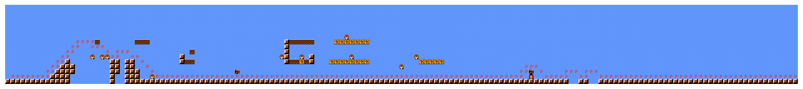
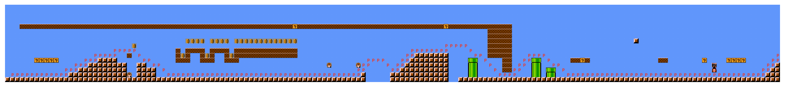
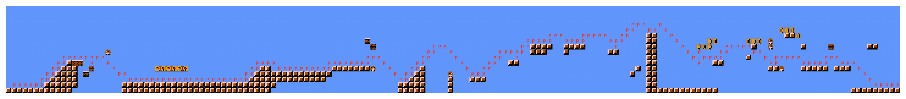
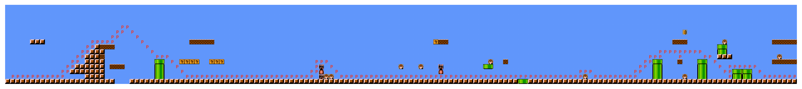
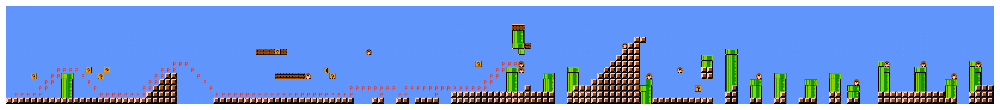

## Description

This repo intends to replicate [Super Mario as a String: Platformer Level Generation Via LSTMs](https://arxiv.org/abs/1603.00930). However, there are some differences between this implementation and what the paper describes. In this implementation:

- Snaking and level depth are not used.
   - Although the paper claims that the number of characters between the left and right sides of pipes are decreased by snaking down and up, it is also obvious that this number is increased by snaking up and down. They are two sides of the same coin.
   - The paper claims that one depth character is added to the fifth column, two depth characters are added to the tenth column and etc. This means that an average Mario level (~200 columns) would have 40+ depth characters appended to later columns. To me, this seems very inefficient since `seq_length` is only 200.
- Validation is done after each epoch instead of every 200 training examples (I guessed this number; the paper was not clear on this).
- The LSTM here is used similar to Andrej Karpathy's [min-char-rnn.py](https://gist.github.com/karpathy/d4dee566867f8291f086), which supports seeds of arbitrary length during generation. It isn't clear what the paper used. 
   - Please read through Andrej's code line-by-line if you are confused; it gave me a crystal clear understanding of the difference between a LSTM and a standard feed-forward neural network (that simply uses the last n to characters to predict the next). 
   - To see some empirical evidence that LSTM memorizes longer than `seq_length` used for training, check out the first paragraph of section 4.2 of [Visualizing and Understanding Recurrent Networks](https://arxiv.org/pdf/1506.02078.pdf) by Andrej.
- Perfect pipe generation is not achieved here.

Please shoot me a pull request or message if you have any suggestions.

## Instructions

To understand how everything works, please go through the following notebooks in sequence:

1. `01_preprocess_data.ipynb`
2. `02_train_model.ipynb`
3. `03_generate_txt_from_model.ipynb`
4. `04_convert_txt_to_png.ipynb`

## Example generations

