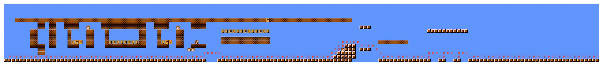

## Description

This repo intends to replicate [Super Mario as a String: Platformer Level Generation Via LSTMs](https://arxiv.org/abs/1603.00930). 

## Instructions

To understand how everything works, please go through the following notebooks in sequence:

1. `01_preprocess_data.ipynb`
2. `02_train_model.ipynb`
3. `03_generate_txt_from_model.ipynb`
4. `04_convert_txt_to_png.ipynb`

## Example generations

